  

  
  
  

Every project below has a validation plan written **before** the first result, and each one reports the checks it failed.

## Projects

<b><a href="https://vintage-credit-risk.vercel.app">Live site</a></b> · <a href="https://vintage-credit-risk.vercel.app/powerbi">Power BI report</a> · <a href="https://github.com/Ghostboy789/vintage-credit-risk">Code</a> · <a href="https://github.com/Ghostboy789/vintage-credit-risk/blob/main/docs/COMMITTEE_MEMO.md">Committee memo</a>

<b><a href="https://pitwall-f1-strategy.onrender.com">Live dashboard</a></b> · <a href="https://github.com/Ghostboy789/pitwall-f1-strategy">Code and validation plan</a>

<b><a href="https://limitiq-credit-line-optimization.onrender.com">Live app</a></b> · <a href="https://github.com/Ghostboy789/limitiq-credit-line-optimization">Code and governance docs</a>

Pit Wall and LimitIQ run on a free tier: the first load can take up to a minute to wake.

<b>The part I'd want a risk person to read</b>

 

- **Vintage.** The scorecard ranks risk out of time (Gini 0.5336 [0.5055, 0.5625]) but six of seven grades fail out-of-time calibration. The overall ratio looks fine only because two windows err in opposite directions. The LightGBM challenger lost to a pre-set promotion rule and was not promoted. The memo recommends research use only.
- **Pit Wall.** The optimiser claimed 17.6 s per car against a 2.0 s limit. After four rounds of real bug fixes I stopped, because tuning until a pre-registered check passes defeats the check. The cause: the simulator charges +9.9 s [+2.3, +17.3] for an extra pit stop that real races price at roughly nothing.
- **LimitIQ.** Version one gave all 288 eligible accounts the maximum +30%: a corner solution from my own linear maths. Fixing it cut the headline contribution by 85%. A calibration challenge "won" by 0.00004 Brier with an interval crossing zero, so I didn't promote it.

## Toolkit

  
  
  
  
  
  
  
  
  
  

**Methods:** WoE/IV scorecards · IFRS 9 ECL · probability calibration · bootstrap intervals · survival and censoring · model validation

  
  

## Other work

| Project | What it is |
|---|---|
| [Financial fraud detection](https://github.com/Ghostboy789/Advanced-Model-For-Financial-Fraud-Detection) | Co-authored a **filed** patent application and a published paper on the approach with a faculty advisor |
| [TikTok claims classification](https://github.com/Ghostboy789/TikTok-Analysis-Project) | Claim-vs-opinion modelling on a large annotated corpus |
| [Salifort Motors attrition](https://github.com/Ghostboy789/Salifort-Motors) | Attrition modelling and driver analysis |
| [Healthcare dashboard](https://github.com/Ghostboy789/Healthcare-Dashboard) · [Housing market analysis](https://github.com/Ghostboy789/Housing-market-analysis-using-tableau) | Analytics and visualisation work |

## About

Product Manager Intern, moving into **credit risk and data analytics**. B.Tech Computer Engineering, DY Patil University, 2026. I write the brief at work; these projects are where I do the model-layer work myself.

Open to credit risk, data analyst and product analyst roles in **Bangalore and Pune**.
